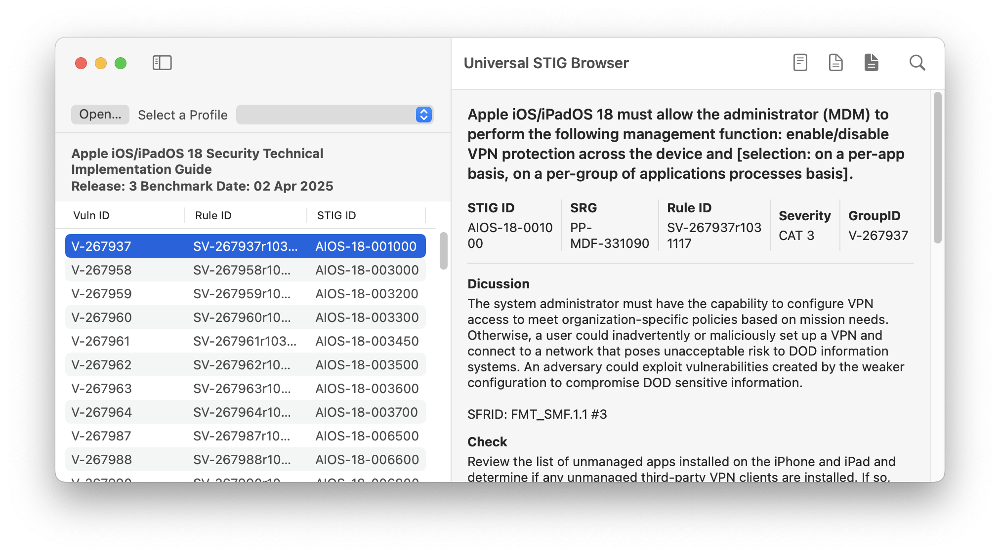
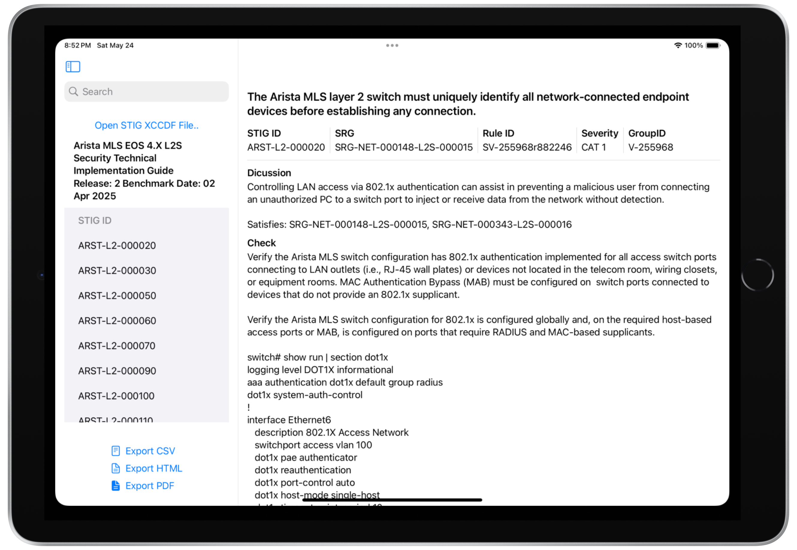
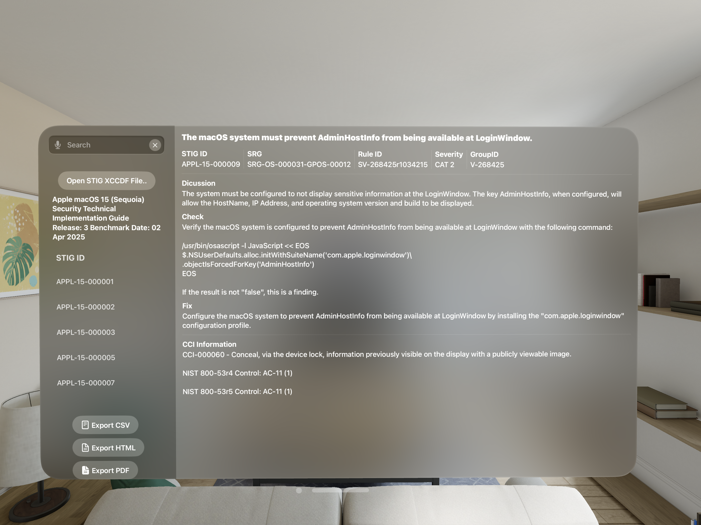

<!-- App Store Badge -->

  

  <strong>Requires:</strong> macOS 14+, iPadOS 17+, visionOS 2.0+

<!-- About Section -->

  <h2>About Universal STIG Browser</h2>
  

    Universal STIG Browser is a native Apple platform app that lets users view, filter, and export Security Technical Implementation Guides (STIGs) published by DISA in XCCDF format. It’s designed for federal compliance professionals, auditors, and cybersecurity teams working in macOS, iPadOS, and visionOS environments.
  

<!-- Feature Highlight -->

  

    <h2>Why Universal STIG Browser?</h2>
    
Built for federal IT professionals, security teams, and auditors. Universal STIG Browser simplifies STIG viewing, comparison, and mobility across all Apple platforms.

  

<!-- Platform Screenshots -->

  

    
    <h3>macOS</h3>
    
Multi-STIG comparison, profile filtering, offline support.

  

  

    
    <h3>iPadOS</h3>
    
Touch-optimized STIG reading experience on the go.

  

  

    
    <h3>visionOS</h3>
    
First-ever STIG viewer designed for spatial computing.

  

<!-- Key Features -->

  <h2>Key Features</h2>
  <ul>
    <li><strong>Search:</strong> Search for any word within the DISA STIG file.</li>
    <li><strong>Export to HTML:</strong> Export selected rules to HTML.</li>
    <li><strong>Export to PDF:</strong> Export selected rules to PDF.</li>
    <li><strong>Export to CSV:</strong> Export selected rules to CSV.</li>
  </ul>

<!-- Privacy Policy -->

  <h2>Privacy Policy</h2>
  
Universal STIG Browser does not collect, store, or transmit any personal or device data. All processing is done locally on-device.

<!-- Support -->

  
For support or feedback,  please file an issue on the <a href="https://github.com/boberito/UniversalSTIGBrowser" target="_blank">GitHub page.</a>

